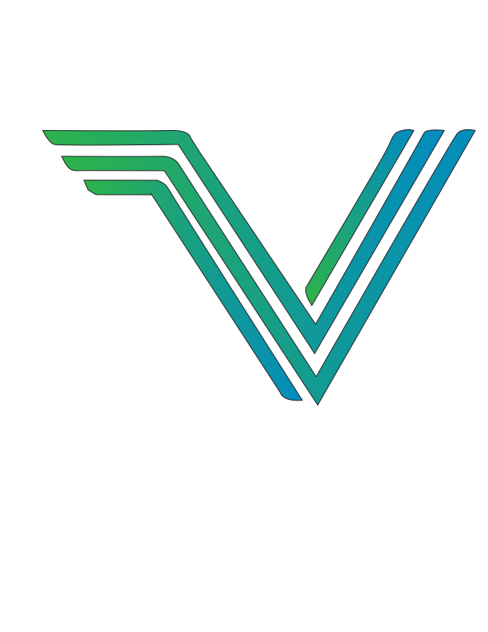

<a id="readme-top"></a>

<!-- PROJECT LOGO -->
<br />
<div align="center">
  <a href="https://github.com/Jackrayallday/Vigil-IoT">
    
  </a>

  <h3 align="center">Vigil IoT</h3>

  <p align="center">
    Vite + React UI for exploring discovered IoT devices, their services, and associated risks.
    <br />
    <a href="https://github.com/Jackrayallday/Vigil-IoT"><strong>Explore the repo &raquo;</strong></a>
  </p>
</div>

<!-- TABLE OF CONTENTS -->
<details>
  <summary>Table of Contents</summary>
  <ol>
    <li>
      <a href="#about-the-project">About The Project</a>
      <ul>
        <li><a href="#built-with">Built With</a></li>
      </ul>
    </li>
    <li>
      <a href="#getting-started">Getting Started</a>
      <ul>
        <li><a href="#prerequisites">Prerequisites</a></li>
        <li><a href="#installation">Installation</a></li>
      </ul>
    </li>
    <li><a href="#usage">Usage</a></li>
    <li><a href="#roadmap">Roadmap</a></li>
    <li><a href="#contributions">Contributions</a></li>
    <li><a href="#license">License</a></li>
    <li><a href="#contact">Contact</a></li>
    <li><a href="#acknowledgments">Acknowledgments</a></li>
    <li><a href="#notes">Notes</a></li>
  </ol>
</details>

## About The Project

Vigil IoT is a desktop-first security dashboard for discovering local IoT devices, viewing scan findings, and managing scan reports.

<p align="right">(<a href="#readme-top">back to top</a>)</p>

### Built With

- [React](https://react.dev/)
- [Vite](https://vite.dev/)
- [Electron](https://www.electronjs.org/)
- [Node.js](https://nodejs.org/)
- [Express](https://expressjs.com/)
- [MySQL](https://www.mysql.com/)
- [FastAPI](https://fastapi.tiangolo.com/)
- [Uvicorn](https://www.uvicorn.org/)
- [Docker](https://www.docker.com/)

<p align="right">(<a href="#readme-top">back to top</a>)</p>

## Getting Started

This is how to set up Vigil IoT locally.

### Prerequisites

- Node.js >= 20.19.0 (need to check these versions)
- npm >= 10 (need to check these versions)
- Python 3.10+ (need to check these versions)
- pip
- Docker Desktop
- Npcap on Windows

### Installation

1. **Clone the repository.**
   ```bash
   git clone --branch main --single-branch https://github.com/Jackrayallday/Vigil-IoT.git
   cd vigil-iot
   ```
2. **Install MySQL.**
   - Download MySQL Community Server from https://dev.mysql.com/downloads/mysql/
   - Install it using the default configuration (or your preferred settings).
   - Make sure the MySQL service is running.
3. **Add your environment variables**
   - Locate the file backend/.env
   - Inside this file, replace all placeholder text with your own real environment variables
4. **Install the SSL certificate for HTTPS Implementation**
   - In File Explorer, navigae to the project's backend directory and double-click localhost.crt
   - Choose Local Machine → click Next.
   - Select Place all certificates in the following store → click Browse.
   - Choose Trusted Root Certification Authorities → click OK → Next → Finish.
   - When prompted, confirm the installation.
5. **Install backend dependencies and run the server program.**
   ```bash
   cd backend
   npm install
   node server.js
   ```
6. **In another terminal instance, install networking dependencies needed for device discovery.**
   ```bash
   cd deviceDiscovery
   pip install scapy zeroconf psutil ifaddr requests netaddr fastapi uvicorn[standard]
   ```
7. **Install frontend dependencies and run the client program.**
   ```bash
   cd frontend
   npm install
   npm run dev:electron
   ```
   - For browser-only development, use:
     ```bash
     npm run dev
     ```
   - To stop use `control c` -> `Y` -> `Enter Key`

<p align="right">(<a href="#readme-top">back to top</a>)</p>

## Usage

- Open the app and click Start Scan.
- Use selected discovered targets or add manual IP/CIDR entries.
- Configure scan options.
- Create a scan and review findings in Scan Results.
- Save reports to the backend (requires login).
- Open Previous Scans to load saved reports.
- Open a device row to view device details.

<p align="right">(<a href="#readme-top">back to top</a>)</p>

## Roadmap
### Fall 2025
- [X] Initialize a functional frontend with minimal features
- [X] Initialize the database schema
- [X] Initialize a functional backend with minimal features
- [X] Implement sessions to keep track of users' login status
- [X] Implement password hashing for security in database
- [X] Implement a password-reset feature, including email-senfing and reset tokens
- [X] Use  ARP, SSDP, mDNS, Nmap, and Scapy protocols for device discovery
- [X] Create a file of known CVE data and use it to match vulnerabilities against device data
- [X] Containerize the backend with Docker

### Spring 2026
- [X] Update server 400-level responses for bad requests and handle them in frontend accordingly
- [X] Rework the frontend to have a more modern look, new colors, and updated logo
- [X] Enforce minimum password strength rules in the frontend
- [ ] Add animations and smooth transitions between pages
- [ ] Implement retrieval of CVE data from NIST's database using an API key from their website
- [ ] Implement Linux device discovery
- [ ] Begin work on Raspberry Pi and explore how to collect information with it
- [ ] Expand vulnerability matching capabilities with additional data from prior updates
- [ ] Store user sessions in the database instead of Node.js MemoryStore
- [ ] Begin implementing the ML algorithm
- [ ] Deliver version 1.0 of the online web interface
- [ ] Add audio for selected clicks or application startup
- [ ] Change server configuration to use HTTPS instead of HTTP

<p align="right">(<a href="#readme-top">back to top</a>)</p>

## Contributions

We are not accepting contributions at this time.

<p align="right">(<a href="#readme-top">back to top</a>)</p>

## License

No LICENSE file is currently present in this repository.

<p align="right">(<a href="#readme-top">back to top</a>)</p>

## Contact

Project maintainers: Vigil IoT team

- Jack Ray - jack.ray@gmail.com
- Richie Delgado - richie.delgado@example.com
- Kevin Volkov - kevin.volkov@example.com
- Afnan Khan - afnan.khan@example.com
- Shelly Ulman - shelly.ulman@example.com

Project Link: https://github.com/Jackrayallday/Vigil-IoT

<p align="right">(<a href="#readme-top">back to top</a>)</p>

## Acknowledgments

- [React Documentation](https://react.dev/)
- [Electron Documentation](https://www.electronjs.org/docs/latest/)
- [FastAPI Documentation](https://fastapi.tiangolo.com/)
- [Vite Documentation](https://vite.dev/guide/)
- [Docker Documentation](https://docs.docker.com/)

<p align="right">(<a href="#readme-top">back to top</a>)</p>

## Notes

- Please add your name at the top of any file you edit where a contributor list is expected.
- The "Previous scans" button appears only after you create your first scan.
- All scan data is stored locally.
- Many files in this repo come from Electron/React boilerplate, so you don't need to worry about cleaning them up right now.
- I used Vite to generate the format of this file structure.

<p align="right">(<a href="#readme-top">back to top</a>)</p>
